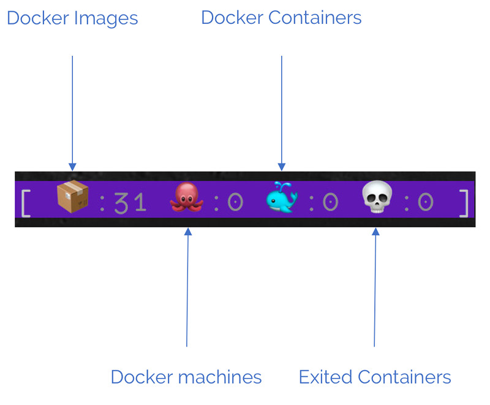

#Docker Tmux Statusbar to get Docker count informations in your CLI.

It display 4 *docker* counters :

- number of docker images
- number of running docker-machine
- number of running containers
- number of exited containers

